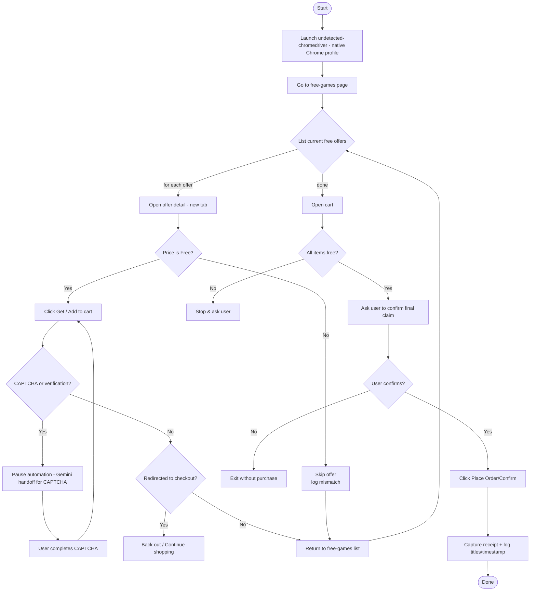

epic-gemini

Scaffold for an Epic Games free-game claimer that uses undetected-chromedriver
and can hand off CAPTCHA handling to a Gemini Computer Use flow (human-in-the-loop).

Quickstart

- Install dependencies with uv:
  - `uv sync`
- Run CLI:
  - `uv run epic-gemini --user-data-dir /path/to/Chrome/User\ Data`

Lint and format

- `uvx ruff check .`
- `uvx ruff format .`

Type check

- `uvx pyright`

Notes

- This project only provides the basic structure and stubs. You must implement
  site-specific selectors and the Gemini API integration for your environment.

Flow Diagram

